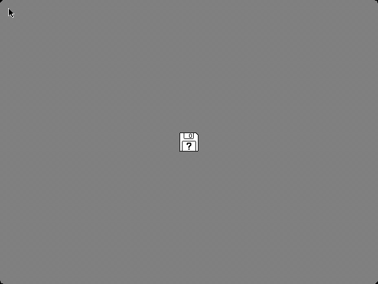
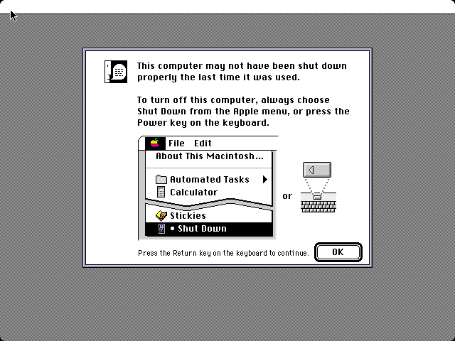
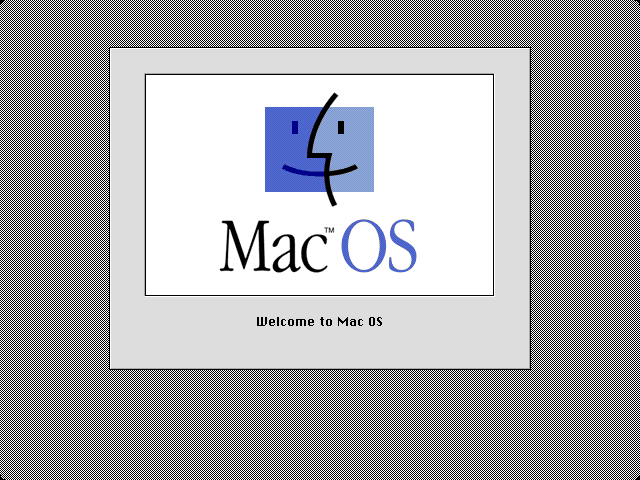

# SheepShaver AArch64 JIT — Project Plan

## Goal

Bring SheepShaver's PPC emulation to full native performance on AArch64,
starting with an optimized interpreter and progressing to a direct-codegen JIT.

## Current Status (April 2026)

**Mac OS boots with the AArch64 JIT active.**

| Metric | Value |
|--------|-------|
| Opcode coverage during boot | **100%** (zero misses) |
| Block completion rate | **92.3%** (110K+/120K+ blocks native) |
| JIT benchmark (addi+bdnz 100M) | **382 MIPS** (2.2x over interpreter) |
| Interpreter benchmark | 167 MIPS |
| Total opcode handlers | ~85 PPC → ARM64 |
| FPU support | ✅ double + single precision |
| Boot tested | Mac OS 7.5 to desktop ("Welcome to Mac OS") |

### Screenshots

| Stage | Screenshot |
|-------|-----------|
| ROM boot (no disk) |  |
| Mac OS boot |  |
| JIT-enabled boot |  |

## Architecture

### Interpreter path (always available)
```
PPC instruction → ppc-decode.cpp → ppc-execute.cpp (Duff's device dispatch)
                                    ↓
                            direct memory access via host pointers
```

### JIT path (AArch64, USE_AARCH64_JIT)
```
PPC instruction → ppc-cpu.cpp execute loop
                    ↓
              ppc-jit-aarch64.cpp (compile basic block to ARM64)
                    ↓
              ppc-codegen-aarch64.h (ARM64 instruction encoding)
                    ↓
              jit-cache (RWX mmap, icache flush)
                    ↓
              native execution: void block(powerpc_registers *regs)
                    ↓
              fall back to interpreter for incomplete blocks
```

### Code layout
```
src/kpx_cpu/src/cpu/jit/aarch64/
  ppc-jit-aarch64.h          — JIT public interface
  ppc-jit-aarch64.cpp        — PPC → ARM64 compiler (~85 opcode handlers)
  ppc-jit-aarch64-glue.hpp   — integration with ppc-cpu.cpp execute loop
  ppc-codegen-aarch64.h      — ARM64 instruction encoding helpers
  jit-target-cache.hpp       — AArch64 icache flush + RWX mapping
  dyngen-target-exec.h       — PPC → ARM64 register mapping constants
```

### Register convention for generated code
```
x20 = pointer to powerpc_registers struct (callee-saved)
x0-x3 = scratch / temporaries
d0-d2 = FP scratch (for FPU ops)
GPR[n] accessed via LDR/STR Wt, [x20, #n*4]
FPR[n] accessed via LDR/STR Dt, [x20, #128+n*8]
CR/LR/CTR/XER/PC at known offsets from x20
```

## Opcode Coverage

### Integer ALU (11)
`addi`/`li`, `addis`/`lis`, `addic`, `addic.`, `mulli`,
`add(.)`/`subf(.)`/`neg(.)`, `mullw`, `divw`

### Logical (6)
`ori`, `oris`, `xori`, `xoris`, `andi.`, `andis.`

### Shift/Rotate (6)
`slw`, `srw`, `sraw`, `srawi`, `rlwinm`, `rlwimi`

### Compare (4)
`cmpwi`, `cmplwi`, `cmpw`, `cmplw` — all with CR field update

### Record forms
`add.`, `subf.`, `and.`, `or.`, `xor.`, `neg.` — CR0 update via CSEL

### Branch (7)
`b`, `bl`, `bdnz` (with intra-block backward chaining),
`beq`/`bne`/`blt`/`bgt`/`ble`/`bge`/`bhi`/`bls`...,
`blr`, `bctr`/`bctrl`, `isync`

### Load/Store integer (13)
`lwz`/`lwzu`/`lwzx`, `stw`/`stwu`/`stwx`,
`lbz`/`stb`, `lhz`/`lha`/`sth`, `lmw`/`stmw`

### Load/Store FP (4)
`lfs` (single→double), `lfd` (double), `stfs` (double→single), `stfd` (double)

### FP arithmetic double (12)
`fmr`, `fneg`, `fabs`, `fnabs`, `fadd`, `fsub`, `fmul`, `fdiv`,
`fmadd`, `fmsub`, `fnmadd`, `fnmsub`, `fcmpu`

### FP arithmetic single (4)
`fadds`, `fsubs`, `fmuls`, `fdivs` (compute double, round to single)

### Utility (9)
`cntlzw`, `extsh`, `extsb`, `srawi`,
`mfspr`/`mtspr` (LR, CTR), `mfcr`, `mtcrf`, NOP

## Completed Phases

### Phase 1: Interpreter baseline ✅
- Interpreter already achieves 167 MIPS with Duff's device + block cache
- Computed-goto optimization deferred (diminishing returns)
- Test harness (`jit-test/`) with 28+ PPC opcode vectors

### Phase 2: JIT scaffolding ✅
- Direct codegen compiler: `ppc-jit-aarch64.cpp`
- ARM64 instruction encoding: `ppc-codegen-aarch64.h`
- Code cache: 4MB RWX mmap with icache flush
- Integration into `ppc-cpu.cpp` execute loop
- First native execution verified

### Phase 3: Integer opcode handlers ✅
- All integer ALU, logical, shift/rotate, compare, branch
- Load/store word/byte/halfword with byte-swap
- SPR access, CR move
- Intra-block loop chaining for bdnz
- Record forms (CR0) for ALU ops

### Phase 4: FPU ✅
- Double-precision arithmetic: fadd/fsub/fmul/fdiv
- Fused multiply-add: fmadd/fmsub/fnmadd/fnmsub
- FP move/negate/abs
- FP compare → CR field
- Single-precision with round-to-single via FCVT
- FP load/store with endian byte-swap

## Remaining Work

### Phase 5: Optimization
- [ ] Block caching (avoid recompilation of same PC)
- [ ] Register pinning (keep hot GPRs in ARM64 callee-saved regs)
- [ ] Block-to-block chaining (avoid returning to dispatch loop)
- [ ] Raise 64-instruction block limit
- [ ] Profile-guided hot-block prioritization

### Not yet implemented (rare opcodes)
- CR logical ops (`crand`, `cror`, `crxor`, etc.) — encoding fix needed
- `mcrf` (move CR field)
- Some conditional `bclr`/`bcctr` with non-trivial BO fields
- `frsp` (FP round to single)
- `fctiw`/`fctiwz` (FP to integer conversion)
- `mffs`/`mtfsf`/`mtfsfi`/`mtfsb0`/`mtfsb1` (FPSCR access)
- `dcbz`/`dcbf`/`dcbi`/`dcbst`/`icbi` (cache management)
- `sync`/`eieio` (memory barriers)
- `sc` (system call)
- `tw`/`twi` (trap)

## Test Harness

```bash
# Run opcode equivalence tests (interpreter determinism)
./jit-test/run.sh

# Run with JIT native execution
SS_TEST_HEX="38600064 388000c8 7CA32214" SS_TEST_DUMP=1 SS_TEST_JIT=1 ./SheepShaver

# Boot Mac OS with JIT
vm.mmap_min_addr=0  # required for low memory globals
USE_AARCH64_JIT=1   # compile flag
```

## Build

```bash
cd src/Unix
./autogen.sh
./configure --enable-sdl-video --enable-sdl-audio
make -j12
# For JIT: rebuild ppc-cpu.cpp with -DUSE_AARCH64_JIT and link ppc-jit-aarch64.o
```

## Constraints

- No dyngen — direct ARM64 emission only
- No ROM patches to work around JIT bugs
- Test-driven: opcode harness validates each handler
- Interpreter always available as fallback for uncompiled blocks
